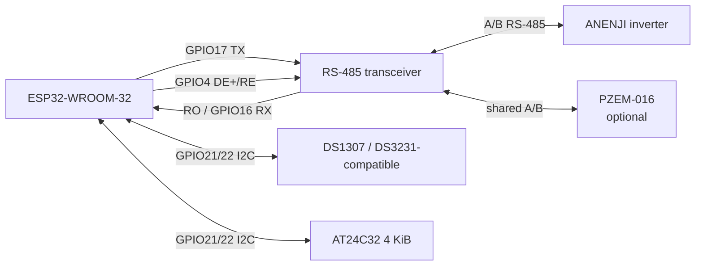
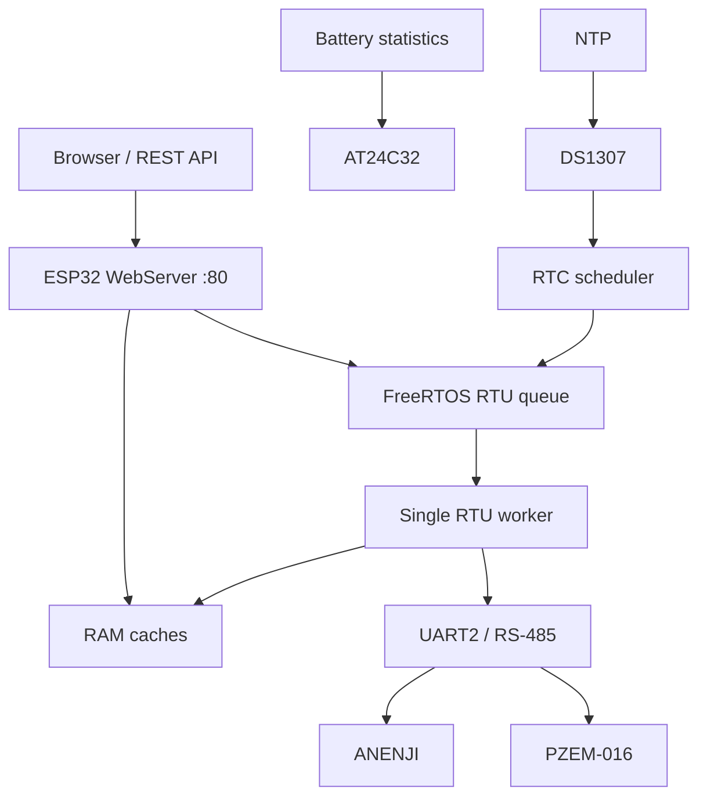

# ESP32 ANENJI Wi‑Fi / RS‑485 Controller

Прошивка для **ESP32-WROOM-32 / ESP32 Dev Module**, предназначенная для локального мониторинга и управления инвертором **ANENJI ANJ-4000W-24V-WIFI** по Modbus RTU/RS‑485.

Версия исходной прошивки: **0.14.31**.

> Проект подготовлен из рабочего монолитного Arduino-скетча. Регистры, GPIO, таймауты и функции ниже описаны по исходному коду. Электрические характеристики конкретного RS‑485-трансивера и модулей питания в исходнике не заданы — сверяйте их с документацией вашей платы.

## Возможности

- Wi‑Fi STA и captive Setup AP для первичной настройки;
- встроенный Web UI на порту 80;
- чтение телеметрии ANENJI каждые ~2 с;
- чтение и изменение разрешённого набора Modbus-регистров;
- профили батарей 24 В `8S 1P` / `8S 2P`;
- справочные профили 48 В с блокировкой несовместимого применения;
- raw register explorer;
- единый FreeRTOS RTU worker — только он работает с UART2/RS‑485;
- RTC DS1307/DS3231-compatible по I²C;
- до 8 заданий планировщика;
- AT24C32: wear-levelled статистика батареи, дневная история и калибровка ёмкости;
- PZEM‑016 на той же RS‑485-шине;
- виртуальные тарифы T1/T2 с сохранением в AT24C32;
- Web OTA;
- watchdog и автоматическое восстановление RTU/Wi‑Fi.

## Аппаратная схема

### ESP32 ↔ RS‑485 трансивер

| ESP32 | RS‑485 модуль | Назначение |
|---|---|---|
| GPIO16 | RO | UART2 RX |
| GPIO17 | DI | UART2 TX |
| GPIO4 | DE + /RE | управление направлением half‑duplex |
| GND | GND | общий провод |
| — | A / B | линия RS‑485 к инвертору и, при использовании, PZEM‑016 |

Параметры UART в прошивке: **9600 baud, 8N1**.

### ESP32 ↔ RTC / EEPROM

| ESP32 | I²C | Устройство |
|---|---|---|
| GPIO21 | SDA | DS1307/DS3231 + AT24C32 |
| GPIO22 | SCL | DS1307/DS3231 + AT24C32 |
| GND | GND | общий провод |

Адрес RTC: `0x68`. AT24C32 ищется в диапазоне `0x50..0x57`. I²C работает на 100 кГц.



> **Важно:** A/B иногда маркируются производителями наоборот. Если обмена нет, сначала проверьте распиновку вашего трансивера и инвертора. Не подключайте ESP32 напрямую к A/B без RS‑485-трансивера.

Подробности: [docs/wiring.md](docs/wiring.md).

## Архитектура

Главная идея прошивки — **single-owner UART**. HTTP-обработчики не выполняют Modbus-транзакции напрямую. Они читают RAM-кэш или ставят работу в очередь. UART2 принадлежит отдельному RTU worker, который сериализует:

- телеметрию;
- refresh настроек;
- raw-чтения;
- ручные записи;
- применение профилей;
- задания планировщика;
- операции PZEM.

Это не даёт медленному или шумному Modbus блокировать синхронный `WebServer`.



Подробнее: [docs/architecture.md](docs/architecture.md).

## Требования

- ESP32-WROOM-32 или совместимая плата;
- Arduino IDE 2.x;
- пакет плат **Arduino-ESP32 3.x** (исходник содержит совместимость с API watchdog этого поколения);
- RS‑485 half-duplex трансивер, совместимый по уровням с ESP32;
- опционально DS1307/DS3231-compatible + AT24C32;
- опционально PZEM‑016.

Внешних Arduino-библиотек в исходнике нет: используются компоненты ESP32 core (`WiFi`, `WebServer`, `Preferences`, `Update`, FreeRTOS, `Wire` и т. д.).

## Сборка и прошивка

1. Откройте `firmware/ANENJI_ESP32_Controller/ANENJI_ESP32_Controller.ino` в Arduino IDE.
2. Выберите плату **ESP32 Dev Module**.
3. Используйте разметку flash, поддерживающую OTA (должны присутствовать OTA app partitions).
4. Соберите и прошейте через USB.
5. Откройте Serial Monitor на **115200 baud**.

При первом старте, если Wi‑Fi ещё не сохранён, устройство поднимет Setup AP вида `ANENJI-SETUP-XXXXXX`. Имя сети и сгенерированный пароль печатаются в Serial Monitor. Setup AP использует `192.168.4.1`.

## BOOT-кнопка

GPIO0 используется для сервисных действий:

- удержание около **5 секунд** при загрузке/работе → перезапуск в Setup AP, сохранённый Wi‑Fi остаётся;
- удержание около **15 секунд** → стирается только namespace Wi‑Fi-конфигурации и запускается Setup AP.

Полное стирание flash/NVS удалит и сохранённые пароли/настройки.

## Сеть и безопасность

Wi‑Fi credentials **не зашиты** в скетч. Они хранятся в NVS namespace `wifi_cfg`. Setup AP password генерируется один раз и сохраняется в `device_cfg`; изначально этот же пароль используется как admin password.

Изменяющие операции требуют HTTP-заголовок:

```text
X-ANENJI-Admin: <admin-password>
```

Прошивка использует обычный **HTTP**, а не HTTPS. Поэтому:

- не публикуйте порт 80 устройства в Интернет;
- размещайте контроллер в доверенной домашней/технической сети или отдельном VLAN;
- не передавайте admin password через недоверенную сеть;
- OTA загружайте только из доверенной LAN.

См. [docs/security.md](docs/security.md).

## Modbus

По умолчанию адрес ANENJI: `1`, baud rate: `9600`. Адрес может храниться в persistent config. PZEM‑016 по умолчанию также использует адрес `1`, поэтому прошивка проверяет конфликт адресов — адрес PZEM и инвертора должны различаться.

Телеметрия инвертора кэшируется из диапазона регистров `200..239`. Изменять через Web UI можно только allow-list регистров, зашитый в `SETTINGS[]`.

Таблицы: [docs/registers.md](docs/registers.md).

## Профили батареи

В исходнике определены четыре профиля:

| Профиль | Система | Назначение |
|---|---:|---|
| `ANJ_24V_8S_1P` | 24 В | LiFePO4 8S, 1 параллельная батарея |
| `ANJ_24V_8S_2P` | 24 В | LiFePO4 8S, 2P |
| `ANJ_48V_STANDARD` | 48 В | исторический профиль для 2×25.6 В последовательно |
| `ANJ_48V_LONG_LIFE` | 48 В | long-life вариант 48 В |

Прошивка определяет семейство напряжения по live/cached данным и блокирует применение профиля к несовместимой системе. Начиная с этой версии отдельный отказавший регистр не обязан обрывать весь профиль: результат может быть `partial`.

## RTC, NTP и планировщик

- RTC: DS1307/DS3231-common subset, адрес `0x68`;
- NTP server по умолчанию: `pool.ntp.org`, fallback: `time.google.com`;
- RTC хранит **локальное гражданское время**;
- offset фиксированный, по умолчанию `UTC+03:00`; автоматического DST в коде нет;
- до 8 расписаний записи Modbus-регистра.

## AT24C32

Внешняя EEPROM используется с wear leveling:

- battery stats slots: первые 2688 байт;
- daily history: следующие 768 байт;
- PZEM tariff data: область с offset `3456`, 8 слотов × 64 байта.

Если EEPROM отсутствует, Web UI и основная работа с инвертором не должны зависеть от неё, но persistent battery/tariff history недоступны.

## REST API

Основные endpoints:

- `GET /api/status`
- `GET /api/settings`
- `POST /api/write`
- `GET /api/write/status`
- `GET /api/profiles`
- `POST /api/profile/apply`
- `GET /api/profile/status`
- `GET /api/raw`
- `GET /api/raw/status`
- `GET|POST /api/network`
- `GET|POST /api/modbus/config`
- `GET /api/battery/stats`
- calibration endpoints
- `GET /api/rtc`, `POST /api/rtc/set`, `POST /api/rtc/ntp`
- PZEM config/tariff/reset endpoints
- `GET|POST /api/schedule`
- Web OTA endpoints.

Полный список и примечания по асинхронным RTU jobs: [docs/api.md](docs/api.md).

## Структура репозитория

```text
.
├── firmware/
│   └── ANENJI_ESP32_Controller/
│       └── ANENJI_ESP32_Controller.ino
├── docs/
│   ├── api.md
│   ├── architecture.md
│   ├── registers.md
│   ├── security.md
│   └── wiring.md
├── .github/
│   └── ISSUE_TEMPLATE/
├── .gitignore
├── CHANGELOG.md
├── CONTRIBUTING.md
└── README.md
```

## Ограничения

- проект привязан к известной карте регистров ANENJI; для другой модели регистры могут отличаться;
- BMS polling в этой версии отсутствует;
- Modbus TCP/RTU gateway удалён;
- HTTPS отсутствует;
- RTC timezone реализован фиксированным offset, без DST rules;
- корректность силовых настроек батареи должен проверять пользователь по документации конкретной АКБ и инвертора.

## Лицензия

В исходном файле лицензия не указана. Перед публичной публикацией выберите подходящую лицензию и добавьте `LICENSE`. Пока лицензия явно не добавлена, не следует считать код автоматически разрешённым для произвольного копирования/распространения третьими лицами.

## Disclaimer

Работа с инвертором и АКБ связана с опасными напряжениями, большими токами и риском повреждения оборудования. Этот проект не заменяет документацию производителя. Перед записью регистров проверьте допустимые значения именно для вашей модели ANENJI и батареи.
