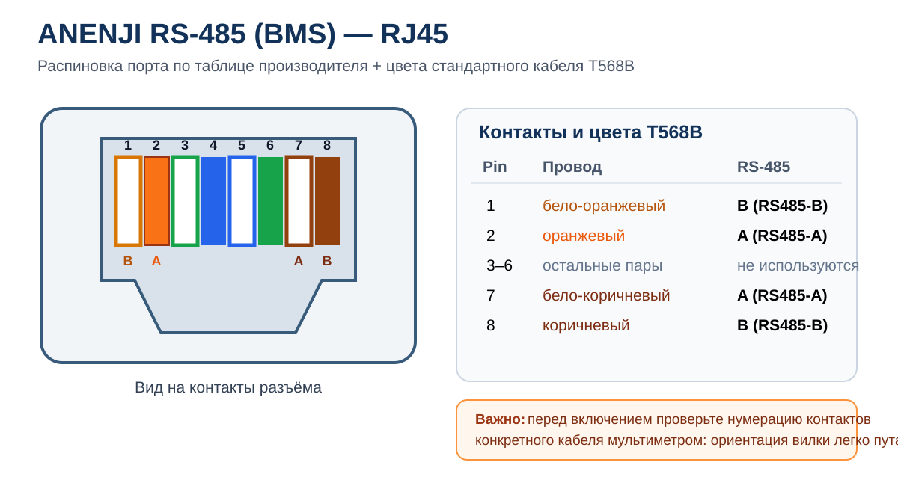
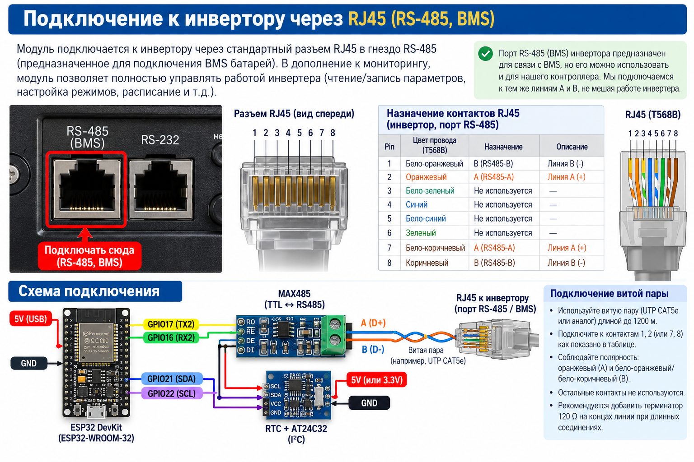
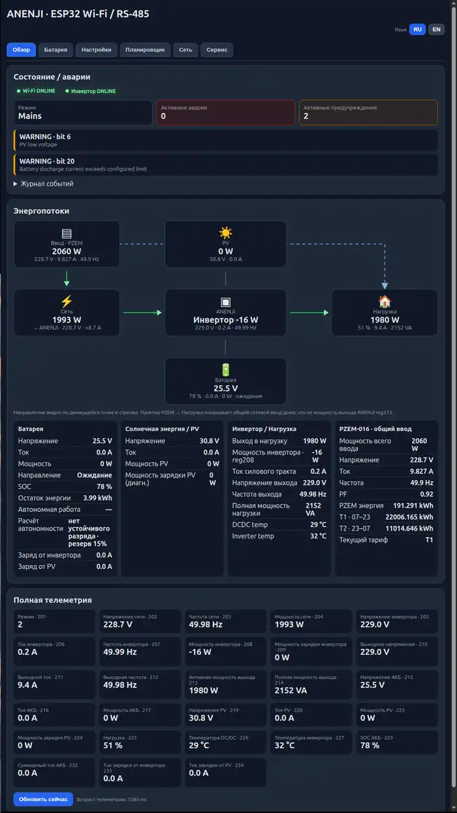
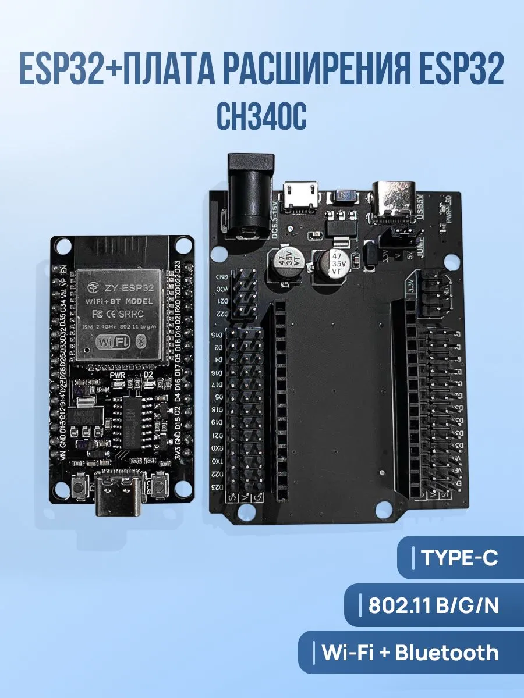
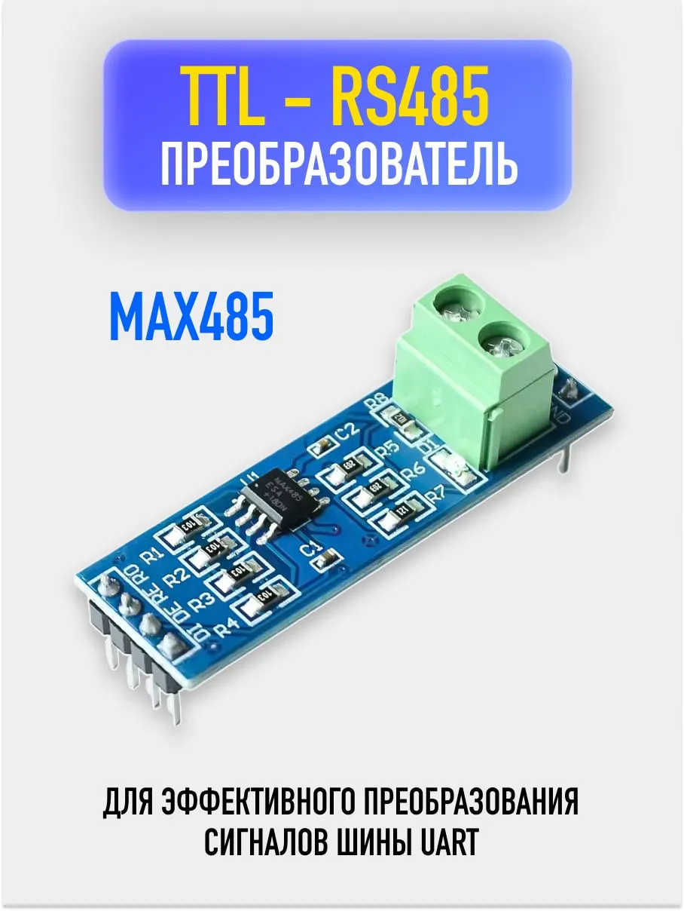
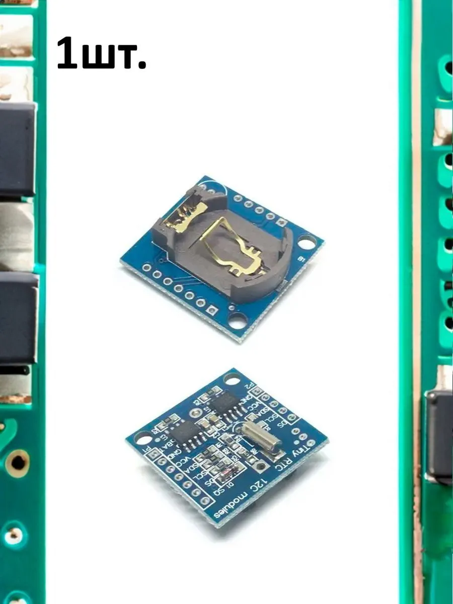
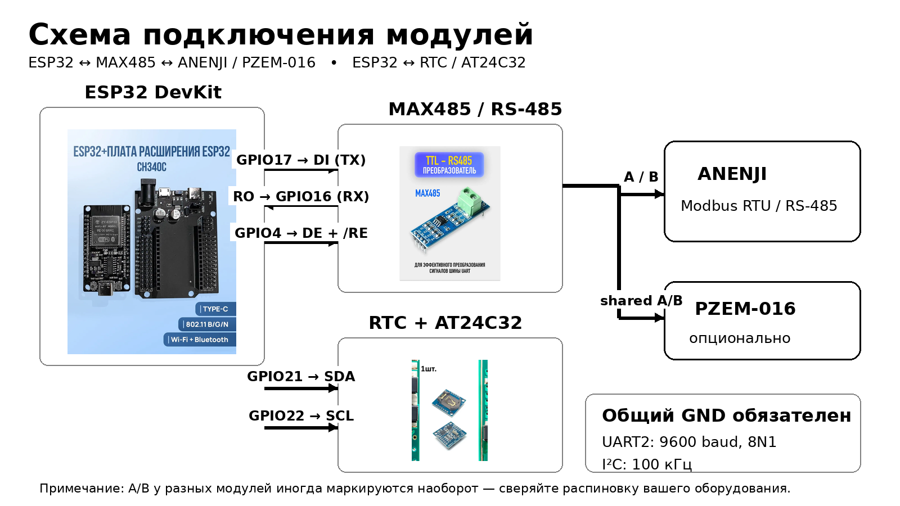
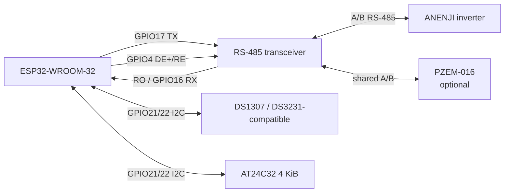
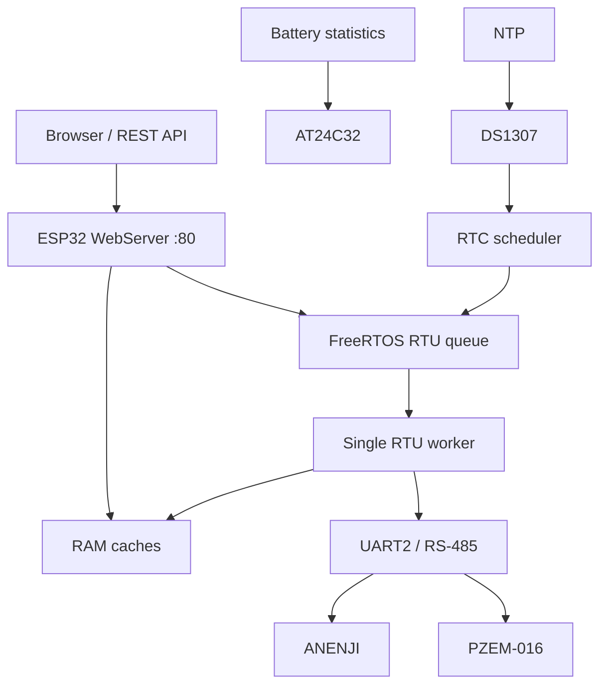

# ESP32 ANENJI Wi‑Fi / RS‑485 Controller

Прошивка для **ESP32-WROOM-32 / ESP32 Dev Module**, предназначенная для локального мониторинга и управления инвертором **ANENJI ANJ-4000W-24V-WIFI** по Modbus RTU/RS‑485.

Текущая версия прошивки: **0.15.9**.

## Подключение к инвертору

Контроллер подключается к инвертору обычным кабелем **RJ45** в гнездо **RS‑485 (BMS)** — штатный порт, предназначенный для обмена с BMS аккумуляторной батареи. В этом проекте тот же RS‑485-интерфейс используется не только для мониторинга: через Modbus RTU контроллер может **читать параметры и полностью управлять доступными настройками и режимами инвертора**, включая запись разрешённых регистров, применение профилей и работу по расписанию.

Внутри инвертора контакты RS‑485 продублированы и **запараллелены попарно**: `1 = RS485-B` параллелен `8 = RS485-B`, а `2 = RS485-A` параллелен `7 = RS485-A`. Вероятно, это сделано для удобства совместного подключения BMS батареи и внешнего контроллера через один физический порт.

**Для подключения нашего контроллера нужно использовать только одну пару контактов — либо 1/2, либо 7/8. Подключать обе пары одновременно не нужно.**

Для стандартно обжатого кабеля **T568B** доступны два равнозначных варианта:

| Вариант | Pin RJ45 | Цвет жилы T568B | RS‑485 | Подключить к MAX485 |
|---|---:|---|---|---|
| **1 (рекомендуемый)** | 1 | бело‑оранжевый | **B** | B |
|  | 2 | оранжевый | **A** | A |
| **2 (альтернативный)** | 7 | бело‑коричневый | **A** | A |
|  | 8 | коричневый | **B** | B |
| — | 3–6 | остальные жилы | не используются | — |

Таким образом, для **варианта 1**: **бело‑оранжевый = B**, **оранжевый = A**. Для **варианта 2**: **бело‑коричневый = A**, **коричневый = B**. Выберите только один вариант и оставьте вторую пару неподключённой. Перед первым включением рекомендуется прозвонить кабель мультиметром: ориентацию вилки RJ45 при ручной нумерации контактов легко перепутать.

<p align="center">
  
</p>

<p align="center">
  
</p>

> **Важно:** маркировка `A/B` у некоторых производителей RS‑485-трансиверов может трактоваться наоборот. Если обмена нет, не меняйте настройки наугад — сначала проверьте распиновку модуля и при необходимости поменяйте A/B местами на стороне трансивера.

> Проект подготовлен из рабочего монолитного Arduino-скетча. Регистры, GPIO, таймауты и функции ниже описаны по исходному коду. Электрические характеристики конкретного RS‑485-трансивера и модулей питания в исходнике не заданы — сверяйте их с документацией вашей платы.


## Демонстрация Web UI

Актуальный рабочий интерфейс контроллера:

<p align="center">
  
</p>

> В README оставлен только этот актуальный снимок реального интерфейса. Старые preview/GIF и автоматически сгенерированные галереи больше не используются.

## Возможности

- Wi‑Fi STA и captive Setup AP для первичной настройки;
- встроенный Web UI на порту 80;
- чтение телеметрии ANENJI каждые ~2 с;
- чтение и изменение разрешённого набора Modbus-регистров с проверкой диапазонов и взаимосвязей;
- полный warning map bit0..20, включая lithium communication и превышение тока разряда;
- журнал событий с локальной датой и временем после синхронизации RTC/NTP/браузером;
- отображение masked и unmasked warning-кодов;
- подтверждённые R/W `316` (dry contact) и `338` (automatic mains output);
- регистр `344` помечен reserved и заблокирован для записи;
- опасные `420/425/426/460/461` не доступны через обычную запись и планировщик;
- профили батарей 24 В `8S 1P` / `8S 2P`;
- справочные профили 48 В с блокировкой несовместимого применения;
- raw register explorer;
- единый FreeRTOS RTU worker — только он работает с UART2/RS‑485;
- RTC DS1307/DS3231-compatible по I²C;
- до 8 заданий планировщика;
- AT24C32: wear-levelled статистика батареи, дневная история и калибровка ёмкости;
- PZEM‑016 на той же RS‑485-шине;
- PZCT-DC63 через ADS1115: локальное измерение DC-тока, автодетект ADS1115 и двухточечная калибровка;
- виртуальные тарифы T1/T2 с сохранением в AT24C32;
- Web OTA;
- watchdog и автоматическое восстановление RTU/Wi‑Fi.

## Аппаратная схема

### Используемые модули (пример)

Ниже приведены **типовые модули**, которые удобно использовать с этой прошивкой. Внешний вид, разводка и маркировка у продавцов могут отличаться, поэтому перед подключением обязательно сверяйте распиновку именно вашего экземпляра.

<table>
  <tr>
    <td align="center" width="33%"><b>ESP32 DevKit / ESP32-WROOM-32</b><br><br><sub>Основной контроллер проекта. На фото — типичный ESP32 DevKit с платой расширения.</sub></td>
    <td align="center" width="33%"><b>TTL ↔ RS-485 (MAX485)</b><br><br><sub>Преобразователь UART ↔ RS-485 для связи ESP32 с инвертором по Modbus RTU.</sub></td>
    <td align="center" width="33%"><b>RTC + EEPROM (Tiny RTC / AT24C32)</b><br><br><sub>Типичный I²C-модуль RTC с резервной батарейкой; в проекте также используется AT24C32 для хранения статистики.</sub></td>
  </tr>
</table>

> Если у вас другая плата ESP32, другой RS‑485-трансивер или иной RTC-модуль — это обычно допустимо, если сохраняются логические уровни, интерфейсы и совместимая распиновка.

### Что понадобится / BOM

| Компонент | Кол-во | Обязателен | Назначение / примечание |
|---|---:|:---:|---|
| ESP32 DevKit / ESP32-WROOM-32 | 1 | ✅ | Основной контроллер, Wi‑Fi и Web UI |
| TTL ↔ RS‑485 transceiver | 1 | ✅ | UART2 ↔ Modbus RTU; на фото показан типовой MAX485-модуль |
| RTC DS1307/DS3231-compatible | 1 | ◻️ | Часы реального времени для планировщика |
| AT24C32 | 1 | ◻️ | Persistent battery/tariff statistics и wear-levelled history |
| Tiny RTC board с AT24C32 | 1 | ◻️ | Удобный вариант, объединяющий RTC и EEPROM на одной I²C-плате |
| PZEM‑016 | 1 | ◻️ | Дополнительный измеритель на общей RS‑485-шине |
| Провода / клеммы / витая пара для A/B | по месту | ✅ | Соединение модулей и линии RS‑485 |
| USB-кабель для ESP32 | 1 | ✅ | Первичная прошивка и Serial Monitor |

> **Важно для MAX485:** у разных готовых модулей питание и TTL-уровни могут отличаться. Перед подключением `RO/DI/DE/RE` к ESP32 убедитесь по схеме именно вашей платы, что её логические уровни совместимы с 3,3 В ESP32.

### Схема подключения с фото-подсказками

<p align="center">
  
</p>

Ключевые соединения на схеме соответствуют прошивке: `GPIO17 → DI`, `RO → GPIO16`, `GPIO4 → DE + /RE`, `GPIO21 → SDA`, `GPIO22 → SCL`. Линия `A/B` идёт к ANENJI и при необходимости используется совместно с PZEM‑016.

### ESP32 ↔ RS‑485 трансивер

| ESP32 | RS‑485 модуль | Назначение |
|---|---|---|
| GPIO16 | RO | UART2 RX |
| GPIO17 | DI | UART2 TX |
| GPIO4 | DE + /RE | управление направлением half‑duplex |
| GND | GND | общий провод |
| — | A / B | линия RS‑485 к инвертору и, при использовании, PZEM‑016 |

Параметры UART в прошивке: **9600 baud, 8N1**.

### ESP32 ↔ RTC / EEPROM

| ESP32 | I²C | Устройство |
|---|---|---|
| GPIO21 | SDA | DS1307/DS3231 + AT24C32 |
| GPIO22 | SCL | DS1307/DS3231 + AT24C32 |
| GND | GND | общий провод |

Адрес RTC: `0x68`. AT24C32 ищется в диапазоне `0x50..0x57`. I²C работает на 100 кГц.



> **Важно:** A/B иногда маркируются производителями наоборот. Если обмена нет, сначала проверьте распиновку вашего трансивера и инвертора. Не подключайте ESP32 напрямую к A/B без RS‑485-трансивера.

Подробности: [docs/wiring.md](docs/wiring.md).

### Датчик DC-тока PZCT-DC63 + ADS1115

Прошивка поддерживает опциональный датчик Холла **PZCT-DC63** через **ADS1115** на общей I²C-шине (`GPIO21/22`). В Web UI отображаются ток и напряжение входа АЦП; доступны калибровка нуля и калибровка по известному току.

Два безопасных варианта схемы подключения и порядок калибровки: **[docs/hall-current-ads1115.md](docs/hall-current-ads1115.md)**.


## Архитектура

Главная идея прошивки — **single-owner UART**. HTTP-обработчики не выполняют Modbus-транзакции напрямую. Они читают RAM-кэш или ставят работу в очередь. UART2 принадлежит отдельному RTU worker, который сериализует:

- телеметрию;
- refresh настроек;
- raw-чтения;
- ручные записи;
- применение профилей;
- задания планировщика;
- операции PZEM.

Это не даёт медленному или шумному Modbus блокировать синхронный `WebServer`.



Подробнее: [docs/architecture.md](docs/architecture.md).

## Требования

- ESP32-WROOM-32 или совместимая плата;
- Arduino IDE 2.x;
- пакет плат **Arduino-ESP32 3.x** (исходник содержит совместимость с API watchdog этого поколения);
- RS‑485 half-duplex трансивер, совместимый по уровням с ESP32;
- опционально DS1307/DS3231-compatible + AT24C32;
- опционально PZEM‑016.

Внешних Arduino-библиотек в исходнике нет: используются компоненты ESP32 core (`WiFi`, `WebServer`, `Preferences`, `Update`, FreeRTOS, `Wire` и т. д.).

## Установка Arduino IDE и первичная прошивка

### 1. Установить Arduino IDE и пакет ESP32

1. Установите **Arduino IDE 2.x** с официального сайта Arduino.
2. Откройте **File → Preferences** и в поле **Additional Boards Manager URLs** добавьте:

   `https://espressif.github.io/arduino-esp32/package_esp32_index.json`

3. Откройте **Tools → Board → Boards Manager**, найдите **esp32 by Espressif Systems** и установите пакет **Arduino-ESP32 3.x**.
4. Откройте `firmware/ANENJI_ESP32_Controller/ANENJI_ESP32_Controller.ino`.

### 2. Параметры платы

Для обычного **ESP32-WROOM-32 / ESP32 DevKit** используйте:

| Параметр Arduino IDE | Значение |
|---|---|
| Board | **ESP32 Dev Module** |
| Flash Size | **4MB (32Mb)** |
| Partition Scheme | **Minimal SPIFFS (1.9MB APP with OTA/190KB SPIFFS)** |
| Upload Speed | `460800` или `921600` при стабильном USB |
| Port | COM/tty-порт подключённого ESP32 |

Критичен именно раздел с **OTA app partitions**. Если в установленной версии ESP32 core название пункта немного отличается, выбирайте вариант **Minimal SPIFFS с приложением около 1.9 MB и поддержкой OTA**. Не используйте схему без OTA-раздела.

### 3. Первая прошивка — через USB/UART

Новый ESP32 нужно **хотя бы один раз прошить по USB/UART** из Arduino IDE (или эквивалентным способом через `arduino-cli`/`esptool`). Это записывает приложение и создаёт первоначальную конфигурацию в NVS.

1. Подключите ESP32 к компьютеру USB-кабелем.
2. Нажмите **Upload** в Arduino IDE. Если конкретная плата не входит в bootloader автоматически, удерживайте **BOOT** при начале загрузки и отпустите после старта записи.
3. После прошивки откройте **Serial Monitor** со скоростью **115200 baud**.
4. При первом запуске прошивка создаёт Setup AP вида `ANENJI-SETUP-XXXXXX` и печатает в UART его SSID и сгенерированный пароль.
5. **Обязательно сохраните этот пароль.** Он хранится в NVS и изначально также используется как пароль администратора Web UI.
6. Подключитесь к Setup AP и откройте `http://192.168.4.1`, затем задайте параметры домашней Wi‑Fi сети.

После подключения к вашей сети откройте IP-адрес ESP32 в браузере. Дальнейшие обновления обычно **не требуют Arduino IDE и USB**.

> Если выполнить полное стирание flash/NVS (`Erase All Flash`), Setup/Admin password и сохранённые настройки будут удалены. После такого стирания первичную настройку придётся выполнить заново. Для обычного обновления стирать flash не нужно.

### 4. Дальнейшие обновления через Web OTA

Готовые бинарные файлы публикуются на странице **GitHub Releases**:

**https://github.com/DanilVDV/esp32-anenji-wifi-rs485-controller/releases**

Для обычного обновления через Web UI скачивайте файл вида:

`ANENJI_ESP32_Controller-vX.Y.Z.bin`

Это **основной application binary**. Для Web OTA не выбирайте файлы `bootloader.bin` или `partitions.bin`.

Порядок обновления:

1. Откройте Web UI контроллера.
2. Перейдите в **Сервис → OTA**.
3. Разблокируйте OTA паролем администратора.
4. Выберите скачанный `ANENJI_ESP32_Controller-vX.Y.Z.bin`.
5. Запустите обновление и дождитесь автоматической перезагрузки ESP32.
6. После перезапуска проверьте отображаемую версию прошивки.

USB/UART снова понадобится только при восстановлении после неудачной прошивки, полном стирании flash, повреждении bootloader/partition table либо если Web OTA недоступен.

## BOOT-кнопка

GPIO0 используется для сервисных действий:

- удержание около **5 секунд** при загрузке/работе → перезапуск в Setup AP, сохранённый Wi‑Fi остаётся;
- удержание около **15 секунд** → стирается только namespace Wi‑Fi-конфигурации и запускается Setup AP.

Полное стирание flash/NVS удалит и сохранённые пароли/настройки.

## Сеть и безопасность

Wi‑Fi credentials **не зашиты** в скетч. Они хранятся в NVS namespace `wifi_cfg`. Setup AP password генерируется один раз и сохраняется в `device_cfg`; изначально этот же пароль используется как admin password.

Изменяющие операции требуют HTTP-заголовок:

```text
X-ANENJI-Admin: <admin-password>
```

Прошивка использует обычный **HTTP**, а не HTTPS. Поэтому:

- не публикуйте порт 80 устройства в Интернет;
- размещайте контроллер в доверенной домашней/технической сети или отдельном VLAN;
- не передавайте admin password через недоверенную сеть;
- OTA загружайте только из доверенной LAN.

См. [docs/security.md](docs/security.md).

## Modbus

По умолчанию адрес ANENJI: `1`, baud rate: `9600`. Адрес может храниться в persistent config. PZEM‑016 по умолчанию также использует адрес `1`, поэтому прошивка проверяет конфликт адресов — адрес PZEM и инвертора должны различаться.

Телеметрия инвертора кэшируется из диапазона регистров `200..239`. Изменять через Web UI можно только allow-list регистров, зашитый в `SETTINGS[]`.

Таблицы: [docs/registers.md](docs/registers.md).

> **Экспериментальное наблюдение для режима Lithium:** на проверенном экземпляре ANENJI при выборе в настройках инвертора типа батареи **Lithium** порт `RS-485 (BMS)` фактически переключается на работу с литиевой BMS, после чего обычное Modbus-управление инвертором через этот порт становится недоступно. Это поведение может зависеть от модели и версии заводской прошивки инвертора и поэтому не считается универсально подтверждённым. Если после включения Lithium контроллер перестал видеть инвертор, первым делом верните прежний тип батареи и проверьте RS-485 снова.


## Профили батареи

В исходнике определены четыре профиля:

| Профиль | Система | Назначение |
|---|---:|---|
| `ANJ_24V_8S_1P` | 24 В | LiFePO4 8S, 1 параллельная батарея |
| `ANJ_24V_8S_2P` | 24 В | LiFePO4 8S, 2P |
| `ANJ_48V_STANDARD` | 48 В | исторический профиль для 2×25.6 В последовательно |
| `ANJ_48V_LONG_LIFE` | 48 В | long-life вариант 48 В |

Прошивка определяет семейство напряжения по live/cached данным и блокирует применение профиля к несовместимой системе. Начиная с этой версии отдельный отказавший регистр не обязан обрывать весь профиль: результат может быть `partial`.

## RTC, NTP и планировщик

- RTC: DS1307/DS3231-common subset, адрес `0x68`;
- NTP server по умолчанию: `pool.ntp.org`, fallback: `time.google.com`;
- RTC хранит **локальное гражданское время**;
- offset фиксированный, по умолчанию `UTC+03:00`; автоматического DST в коде нет;
- до 8 расписаний записи Modbus-регистра.

## AT24C32

Внешняя EEPROM используется с wear leveling:

- battery stats slots: первые 2688 байт;
- daily history: следующие 768 байт;
- PZEM tariff data: область с offset `3456`, 8 слотов × 64 байта.

Если EEPROM отсутствует, Web UI и основная работа с инвертором не должны зависеть от неё, но persistent battery/tariff history недоступны.

## REST API

Основные endpoints:

- `GET /api/status`
- `GET /api/settings`
- `POST /api/write`
- `GET /api/write/status`
- `GET /api/profiles`
- `POST /api/profile/apply`
- `GET /api/profile/status`
- `GET /api/raw`
- `GET /api/raw/status`
- `GET|POST /api/network`
- `GET|POST /api/modbus/config`
- `GET /api/battery/stats`
- calibration endpoints
- `GET /api/rtc`, `POST /api/rtc/set`, `POST /api/rtc/ntp`
- PZEM config/tariff/reset endpoints
- `GET|POST /api/schedule`
- Web OTA endpoints.

Полный список и примечания по асинхронным RTU jobs: [docs/api.md](docs/api.md).

## Структура репозитория

```text
.
├── firmware/
│   └── ANENJI_ESP32_Controller/
│       └── ANENJI_ESP32_Controller.ino
├── docs/
│   ├── media/
│   │   ├── demo.gif
│   │   ├── demo.mp4
│   │   ├── dashboard.webp
│   │   ├── battery-stats.webp
│   │   ├── rtc-scheduler.webp
│   │   ├── network-modbus.webp
│   │   ├── service-pzem-ota.webp
│   │   ├── module-esp32-devkit.webp
│   │   ├── module-max485.webp
│   │   ├── module-tiny-rtc-at24c32.webp
│   │   ├── rj45-rs485-pinout.svg
│   │   ├── rj45-rs485-bms-connection.png
│   │   └── wiring-modules.png
│   ├── screenshots.md
│   ├── api.md
│   ├── architecture.md
│   ├── registers.md
│   ├── security.md
│   └── wiring.md
├── .github/
│   └── ISSUE_TEMPLATE/
├── .gitignore
├── CHANGELOG.md
├── CONTRIBUTING.md
└── README.md
```

## Ограничения

- проект привязан к известной карте регистров ANENJI; для другой модели регистры могут отличаться;
- BMS polling в этой версии отсутствует;
- Modbus TCP/RTU gateway удалён;
- HTTPS отсутствует;
- RTC timezone реализован фиксированным offset, без DST rules;
- корректность силовых настроек батареи должен проверять пользователь по документации конкретной АКБ и инвертора.

## Лицензия

В исходном файле лицензия не указана. Перед публичной публикацией выберите подходящую лицензию и добавьте `LICENSE`. Пока лицензия явно не добавлена, не следует считать код автоматически разрешённым для произвольного копирования/распространения третьими лицами.

## Disclaimer

Работа с инвертором и АКБ связана с опасными напряжениями, большими токами и риском повреждения оборудования. Этот проект не заменяет документацию производителя. Перед записью регистров проверьте допустимые значения именно для вашей модели ANENJI и батареи.
