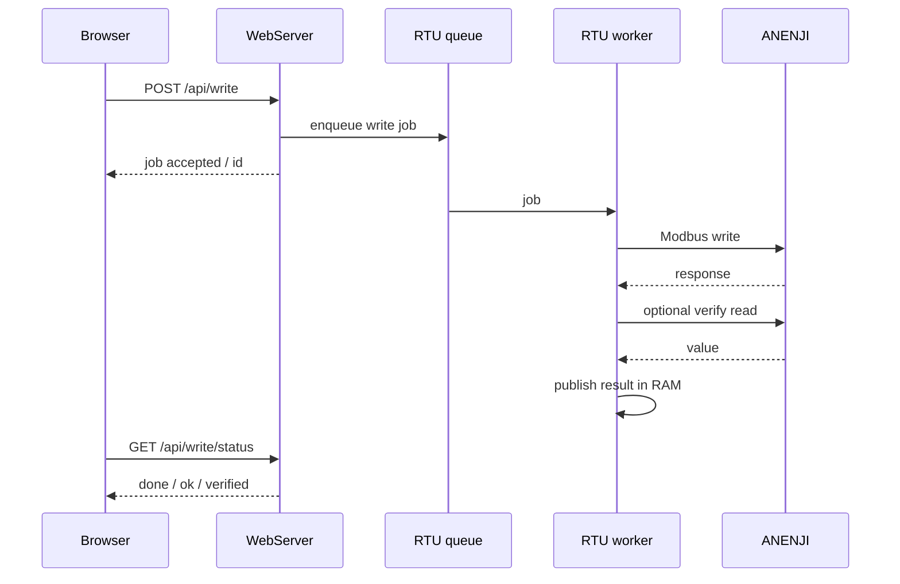

# Архитектура прошивки

## Основные компоненты

### WebServer

`WebServer web(80)` обслуживает UI и REST API. Обработчики должны оставаться быстрыми и не владеть UART2.

### RTU worker

Очередь `rtuJobQueue` и task `anenji_rtu` реализуют единственного владельца UART2. Это ключевой архитектурный инвариант прошивки.

Типы job:

- `RTU_JOB_WRITE`
- `RTU_JOB_RAW`
- `RTU_JOB_PROFILE`
- `RTU_JOB_SCHEDULE`
- `RTU_JOB_CAL_START`
- `RTU_JOB_CAL_RESTORE`
- `RTU_JOB_PZEM_RESET`

Телеметрия и settings refresh также выполняются worker-ом.

### RAM caches

HTTP GET в основном отдаёт данные из памяти. Такой подход изолирует Web UI от задержек Modbus.

### Watchdogs / recovery

В коде присутствуют:

- Task Watchdog;
- контроль heartbeat RTU worker;
- восстановление UART после серии failed polls;
- reboot при длительной потере RTU после ранее подтверждённого online;
- Wi‑Fi watchdog;
- low-heap watchdog.

Во время OTA RTU/scheduler recovery-логика приостанавливается, чтобы запись flash не конфликтовала с обычной работой.

### Persistence

ESP32 NVS (`Preferences`) разделён по namespaces для network/device/app/scheduler settings.

AT24C32 хранит:

- cumulative battery statistics;
- daily history;
- tariff accounting PZEM.

Для EEPROM используются последовательности слотов, уменьшающие износ одной ячейки.

## Потоки данных

## Timing constants из исходника

| Параметр | Значение |
|---|---:|
| RS‑485 baud | 9600 |
| normal telemetry poll | 2000 ms |
| offline poll | 8000 ms |
| manual/API RTU timeout | 800 ms |
| background poll timeout | 260 ms |
| write timeout | 650 ms |
| verify timeout | 350 ms |
| post-write quiet | 1800 ms |
| PZEM poll | 5000 ms |
| Task WDT | 12000 ms |
