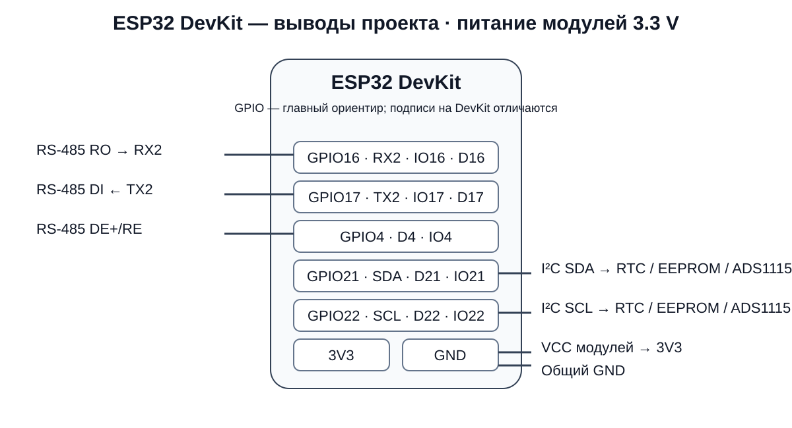

# Wiring / схема подключения

## 1. Подключение к ANENJI через RJ45 — порт RS‑485 (BMS)

Контроллер подключается к инвертору через разъём **RJ45** в гнездо **RS‑485 (BMS)**. Этот порт штатно предназначен для подключения BMS аккумуляторной батареи, однако доступный на нём Modbus RTU позволяет проекту не только читать телеметрию, но и записывать разрешённые параметры инвертора, применять профили и выполнять команды по расписанию.

По предоставленной таблице распиновки порта инвертора:

| Pin RJ45 | Цвет T568B | Сигнал |
|---:|---|---|
| 1 | бело‑оранжевый | **RS485-B** |
| 2 | оранжевый | **RS485-A** |
| 7 | бело‑коричневый | **RS485-A** |
| 8 | коричневый | **RS485-B** |
| 3–6 | остальные жилы | не используются |

Иными словами: **бело‑оранжевый = B, оранжевый = A, бело‑коричневый = A, коричневый = B**.

<p align="center">
  
</p>

<p align="center">
  
</p>

> Перед включением прозвоните кабель мультиметром. При взгляде на вилку с разных сторон нумерация RJ45 визуально зеркалится, поэтому ориентируйтесь на фактическую нумерацию контактов и цвета T568B.

## 2. ESP32 ↔ RS‑485 transceiver

Прошивка использует UART2 ESP32. На разных ESP32 DevKit одна и та же ножка может быть подписана как `4`, `IO4`, `D4` и т. п. **Главный ориентир — номер GPIO**; колонка ниже показывает распространённые варианты шелкографии.

| Сигнал | GPIO | Маркировка на ESP32 DevKit (типично) | Куда подключать |
|---|---:|---|---|
| RX2 | **16** | `RX2` / `IO16` / `16` / `D16` | `RO` RS‑485 transceiver |
| TX2 | **17** | `TX2` / `IO17` / `17` / `D17` | `DI` RS‑485 transceiver |
| Direction | **4** | `D4` / `IO4` / `4` | объединённые `DE` и `/RE` |
| 3.3 V | — | **`3V3` / `3.3V`** | `VCC` RS‑485 transceiver |
| GND | — | **`GND`** | общий GND |

Линии `A` и `B` трансивера идут на соответствующие линии RJ45 инвертора. PZEM‑016 может находиться на этой же half‑duplex шине.

```text
ESP32 DevKit                       RS-485 transceiver            RJ45 ANENJI RS-485 (BMS)
------------                       ------------------            ------------------------
GPIO17 / TX2 / IO17 -------------> DI
GPIO16 / RX2 / IO16 <------------- RO
GPIO4 / D4 / IO4 ----------------> DE + /RE
3V3 / 3.3V ----------------------> VCC
GND ------------------------------> GND
                                     A  --------------------------> A: pin 2 / pin 7
                                     B  --------------------------> B: pin 1 / pin 8
```

<p align="center">
  
</p>

Рекомендации для физического слоя:

- в этой сборке RS‑485-трансивер питается от **3.3 V (`3V3`)**; используйте модуль, рассчитанный на такое питание и логические уровни ESP32;
- общий GND обычно необходим, если нет гальванической развязки;
- используйте витую пару для A/B;
- терминация 120 Ω ставится по правилам конкретной RS‑485 топологии, обычно на концах длинной линии;
- если обмена нет, проверьте адрес Modbus и полярность A/B — маркировка A/B у разных производителей встречается инверсной.

## 3. I²C

| Сигнал ESP32 | GPIO | Маркировка на ESP32 DevKit (типично) | Подключение |
|---|---:|---|---|
| SDA | **21** | `SDA` / `D21` / `IO21` / `21` | SDA RTC / AT24C32 / ADS1115 |
| SCL | **22** | `SCL` / `D22` / `IO22` / `22` | SCL RTC / AT24C32 / ADS1115 |
| 3.3 V | — | **`3V3` / `3.3V`** | VCC всех I²C-модулей |
| GND | — | **`GND`** | общий GND |

```text
ESP32 GPIO21 / SDA / D21 ----+---- DS1307/DS3231 SDA
                              +---- AT24C32 SDA
                              +---- ADS1115 SDA
ESP32 GPIO22 / SCL / D22 ----+---- DS1307/DS3231 SCL
                              +---- AT24C32 SCL
                              +---- ADS1115 SCL
ESP32 3V3 --------------------+---- VCC модулей
ESP32 GND --------------------+---- общий GND
```

Параметры из кода:

- SDA = GPIO21;
- SCL = GPIO22;
- bus = 100 kHz;
- RTC = `0x68`;
- AT24C32 = scan `0x50..0x57`;
- ADS1115 = `0x48..0x4B`;
- I²C timeout = 50 ms.

## 4. BOOT

GPIO0 — штатная BOOT-кнопка многих ESP32 DevKit. На плате она может быть подписана `BOOT`, `IO0`, `0` или `D0`. Прошивка использует её также как сервисную кнопку:

- ~5 с → Setup AP;
- ~15 с → очистка Wi‑Fi config.

Учитывайте это при ручном входе в flashing mode.

## 5. Быстрая шпаргалка по надписям на ESP32 DevKit

| Функция в проекте | GPIO | Что искать на плате |
|---|---:|---|
| RS‑485 RX | 16 | `RX2`, `IO16`, `16`, иногда `D16` |
| RS‑485 TX | 17 | `TX2`, `IO17`, `17`, иногда `D17` |
| RS‑485 DE+/RE | 4 | `D4`, `IO4`, `4` |
| I²C SDA | 21 | `SDA`, `D21`, `IO21`, `21` |
| I²C SCL | 22 | `SCL`, `D22`, `IO22`, `22` |
| BOOT | 0 | `BOOT`, `D0`, `IO0`, `0` |
| Питание модулей | — | `3V3`, `3.3V` |
| Общий провод | — | `GND` |

> У разных DevKit подписи отличаются. Если на вашей плате нет `Dxx`, используйте число `GPIOxx`/`IOxx`: например, GPIO4 — это та же ножка, которую некоторые платы подписывают `D4`.
